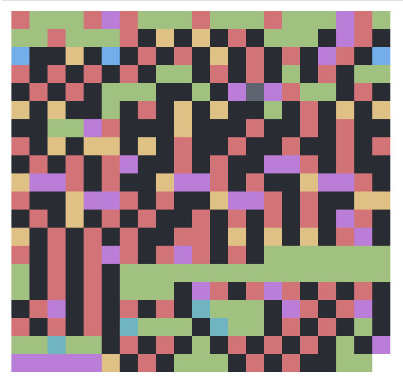

# Code Picture



Code Picture parses a Ruby file and generates a picture of the code structure.
It leverages the [Prism parser] to lex the code and then generates a
simple HTML pixel art.

[Prism parser]: https://github.com/ruby/prism

## Usage

### CLI

Install the gem

```sh
gem install code_picture
```

Then run the command:

```sh
code-picture path-to-file.rb
```

This will generate a `code-picture.html` file in the current directory.

#### Options

You can customize the generated image and the output file with the following
options:

```
Usage: code-picture path-to-file.rb [options]
    -p, --pixel-size=SIZE            Define the pixel size of the generated image
    -r, --max-pixels-per-row=SIZE    Define the maximum number of pixels per row
    -t, --theme=THEME                Define the theme of the generated image [options: one-dark-pro (default), random, or a path to a YAML file]
    -o, --output=FILE                Write the generated image to the given file path
    -v, --version                    Displays app version
    -h, --help                       Prints this help
```

## Development

After checking out the repo, run `bin/setup` to install dependencies. Then, run
`rake spec` to run the tests. You can also run `bin/console` for an interactive
prompt that will allow you to experiment.

To install this gem onto your local machine, run `bundle exec rake install`. To
release a new version, update the version number in `version.rb`, and then run
`bundle exec rake release`, which will create a git tag for the version, push
git commits and the created tag, and push the `.gem` file to
[rubygems.org](https://rubygems.org).

## Contributing

Hey! Thanks for considering contributing to this project. If you have an idea of
a feature, found a bug, or just want to change a color in the existing themes,
feel free to open an issue or a pull request on GitHub at
https://github.com/MatheusRich/code_picture.

## License

The gem is available as open source under the terms of the [MIT
License](https://opensource.org/licenses/MIT).
